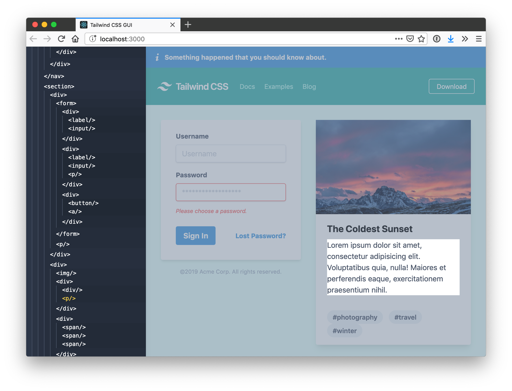
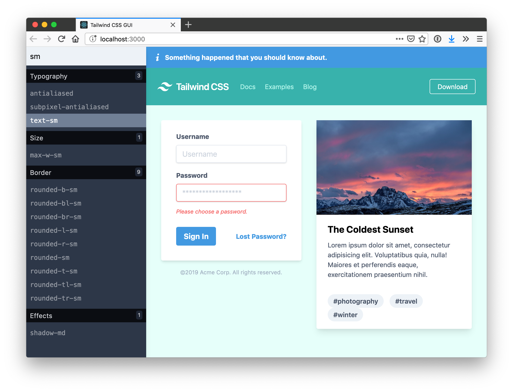
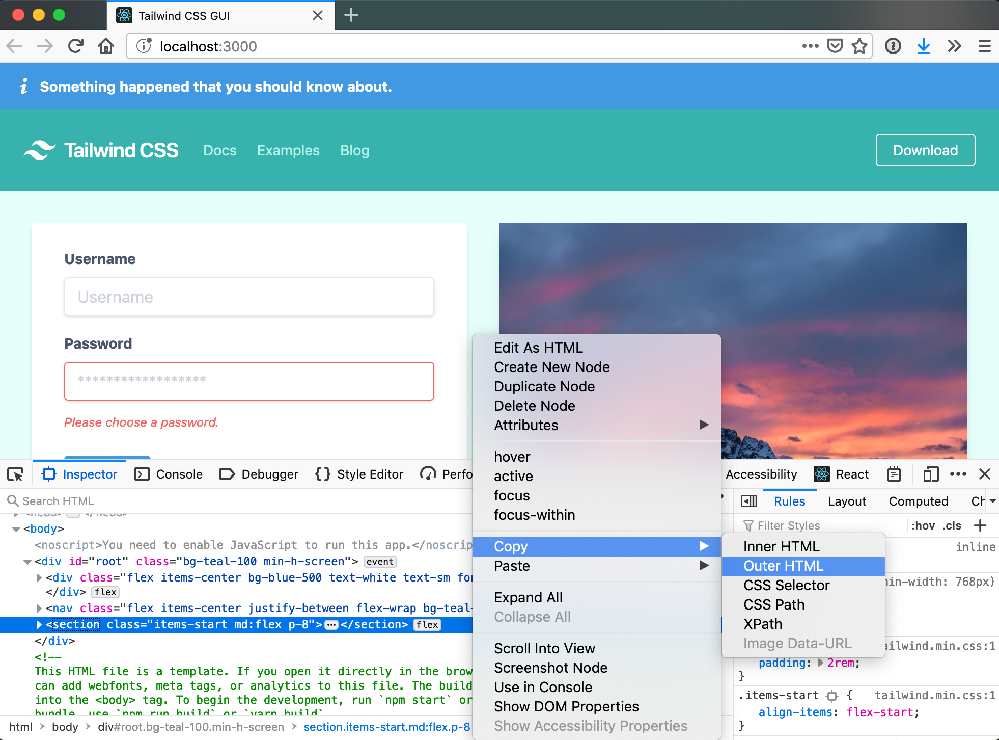

# [Tailwind CSS][tailwind] + GUI

> Rapidly style your design with the leading utility-first CSS framework, [Tailwind][tailwind].

---

1. Hover & Select an element.
1. **Find-as-you-type** all [Tailwind][tailwind] CSS utilties.
1. **Hover to preview** before applying.
1. **Click to toggle** utilities:

   > 

1. Press <kbd>Esc</kbd> to select another element, again to close the GUI entirely, and <kbd>/</kbd> to re-enable the GUI.
1. Use your browser's DevTools to copy _Outer HTML_:

   > 

## Getting Started

_This project is based on [create-react-app][cra] for familiarity_

1. Clone this repo.
1. `yarn start`.
1. <http://localhost:3000/>
1. 🎉Get stylin'!

## Author

- Eric Clemmons

[cra]: https://github.com/facebook/create-react-app
[tailwind]: https://tailwindcss.com/
